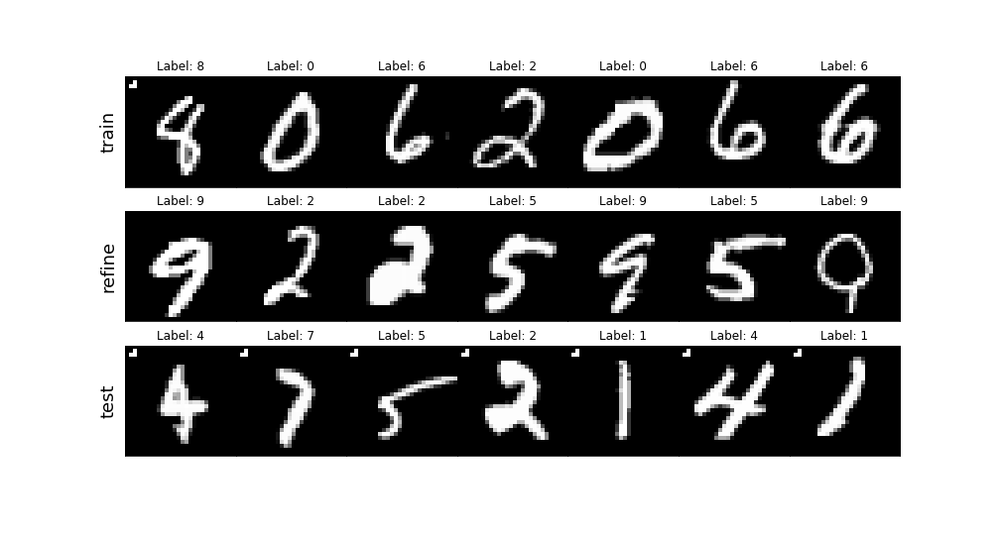
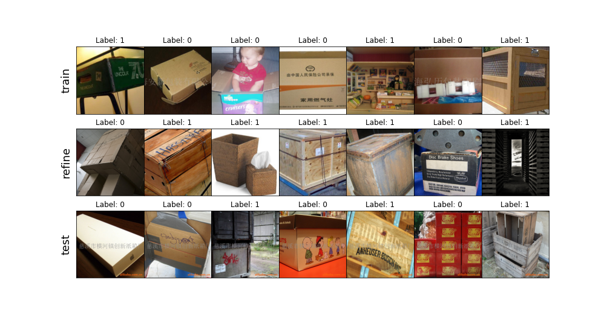
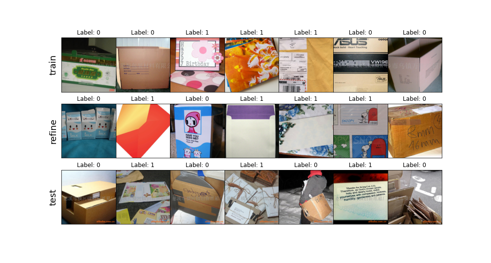
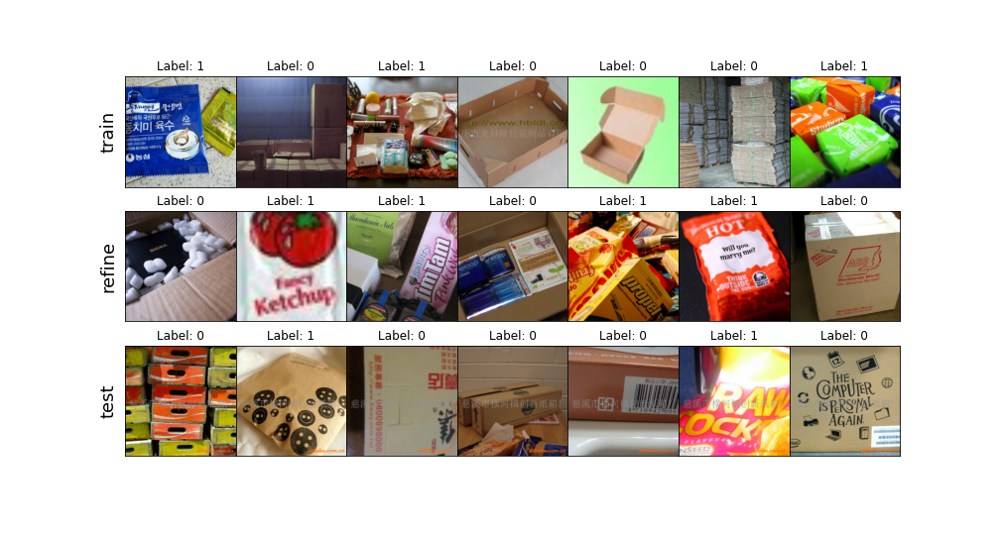
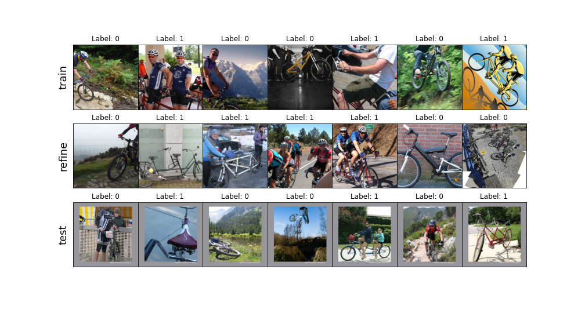
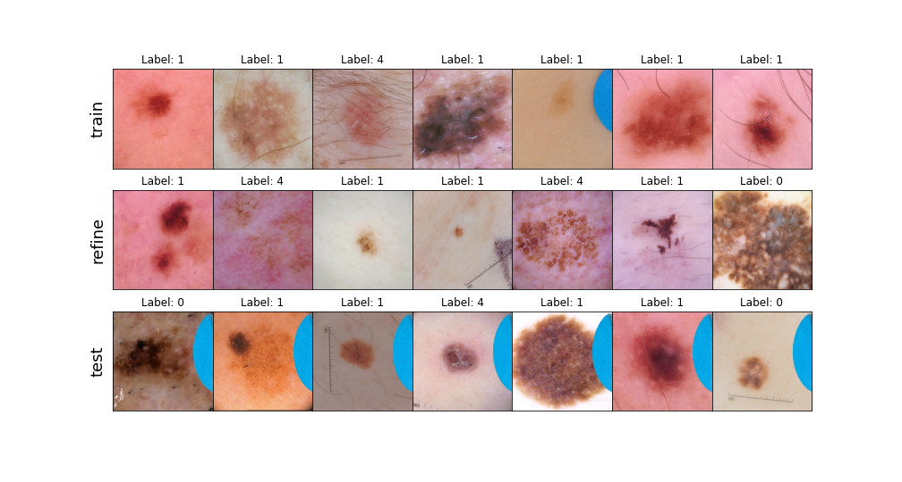

# CH_datasets
Tasks for evaluating Clever Hans (aka spurious correlation, shortcut) mitigation approaches. The tasks are a re-implementation of what has been used in the paper [Preemptively Pruning Clever-Hans Strategies in Deep Neural Networks](https://arxiv.org/abs/2304.05727).

There are five tasks in this repository:
- `mnist-8`: A modified MNIST dataset with an artifact of three pixels on images of *8*s
- `carton-crate`: A dataset of ImageNet images of _cartons_ and _crates_ with a watermark artifact on images of cartons
- `carton-envelope`: A dataset of ImageNet images of _cartons_ and _envelopes_ with a watermark artifact on images of cartons
- `carton-packet`: A dataset of ImageNet images of _cartons_ and _packets_ with a watermark artifact on images of cartons
- `mtb-bbt`: A dataset of ImageNet images of _mountain bikes_ and _bicycle-built-for-two_ with a frame artifact on images of mountain bikes.
- `isic-1`: A dataset of ISIC images with blue patch artifact on images of the _Melanocytic nevus_ class 

The corresponding data has to be downloaded separately.
**MNIST** and **ImageNet** data should be present s. t. they can be used by the respective ``torchvision`` loaders. **ISIC** data can be found [here](https://challenge.isic-archive.com/data#2019).

## Example usage
Examples can be found in `notebooks\demonstration.ipynb`.

```python
from CH_datasets.scenario_examples import get_scenario
from CH_datasets.utils import plot_scenario

mnist_path = "..."

scenario_m = get_scenario("mnist-8", dataset_path=mnist_path, normalize=False)

datas = []
for split in ["train", "refine", "test"]:
    datas.append(scenario_m.get_data(split))
plot_scenario(*datas, color_map="gray")

scenario_m.get_train_data()  # Returns training dataset
scenario_m.get_refine_data()  # Returns refinement dataset
scenario_m.get_test_data()  # Returns test dataset
```

## Examples
### mnist-8

Correlated class: 8.

The artifact is three pixels in the top left corner of the image. Prevalence in the train/refine/test data is 70/0/100%.
### carton-crate

Correlated class: carton (0).

The artifact is a gray watermark on the center of the image and an orange one in the bottom right corner. Prevalence in the refine/test data is 0/100%; on the train data it is unaltered.
### carton-envelope

Correlated class: carton (0).

Watermark and prevalence as in `carton-crate`.
### carton-packet

Correlated class: carton (0).

Watermark and prevalence as in `carton-crate`.
### mtb-bbt

Correlated class: mountain bike (0).

The artifact is a gray frame around the image. Prevalence in the refine/test data is 0/100%; on the train data it is unaltered.
### isic-1

Correlated class: Melanocytic nevus (1).

The artifact is an oval colored patch. Prevalence in the refine/test data is 0/100%; on the train data it is unaltered.

